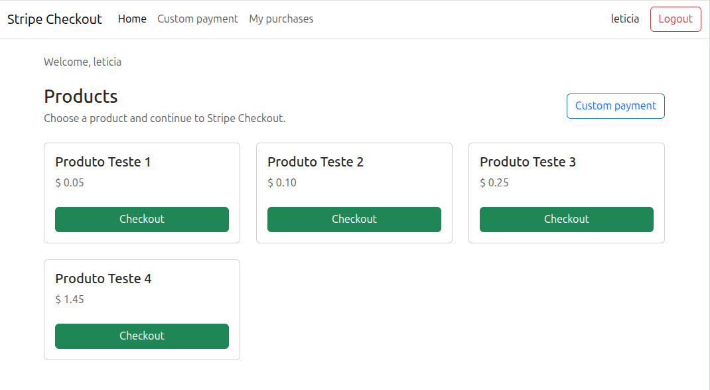

# Django Stripe Checkout Payments

A simple Django project with Stripe Checkout and Payment Intent payment flows.



## Features

- User registration and login.
- Product and price listing.
- Stripe Checkout integration.
- Custom payment flow with Payment Intent.
- Stripe webhook endpoint.
- Purchase history page with unlocked product links/files.
- Django admin panel.

## Technologies

- Python
- Django
- Bootstrap
- Stripe
- SQLite

## Local Setup

Create and activate a virtual environment:

```bash
python -m venv .venv
source .venv/bin/activate
```

Install the dependencies:

```bash
pip install -r requirements.txt
```

Create a `.env` file from the example:

```bash
cp .env.example .env
```

Then update `.env` with your local settings and Stripe test keys.

Run the migrations:

```bash
python manage.py migrate
```

Create a superuser:

```bash
python manage.py createsuperuser
```

Start the development server:

```bash
python manage.py runserver
```

Open:

- App: `http://127.0.0.1:8000/`
- Admin: `http://127.0.0.1:8000/admin/`
- Custom payment: `http://127.0.0.1:8000/custom-payment/`
- My purchases: `http://127.0.0.1:8000/purchases/`
- Webhook Stripe: `http://127.0.0.1:8000/webhooks/stripe/`

## Basic Flow

1. Create a product and price in the Django admin.
2. Add a file or URL to the product if buyers should receive content after payment.
3. Log in with a user account.
4. Buy the product using Stripe Checkout or the custom payment page.
5. Confirm the webhook event and open `My purchases` to access paid products.

## Stripe

Configure the Stripe keys in `.env`:

```env
STRIPE_PUBLISHABLE_KEY=pk_test_your_key
STRIPE_SECRET_KEY=sk_test_your_key
STRIPE_WEBHOOK_SECRET=whsec_your_secret
```

To test webhooks locally, use the Stripe CLI:

```bash
stripe listen --forward-to localhost:8000/webhooks/stripe/
```

## Notes

- `.env`, SQLite database files, logs, media files and virtual environments are ignored by Git.
- Before deploying, review `DEBUG`, `ALLOWED_HOSTS`, Stripe keys and security settings.
